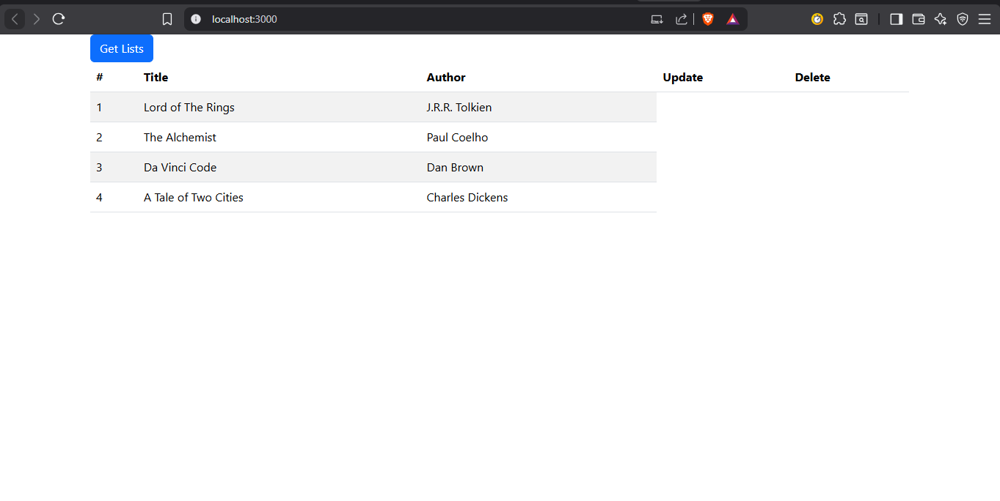

#  CRUD with JSON Server – React Demo

##  Overview

This project demonstrates how to perform **CRUD (Create, Read, Update, Delete)** operations using a **React application** connected to a **local RESTful API** powered by JSON Server. The goal of this exercise was to understand how frontend applications interact with APIs using HTTP methods.

---

##  Setup Process

### 1. Project Initialization

* Created a React application:

```bash
npx create-react-app crud-json-server
```

* Replaced the default `App.js` with the provided version.
* Added `db.json` file in the root directory.

---

### 2. Install Required Packages

```bash
npm install bootstrap
npm install --save-dev json-server concurrently
```

---

### 3. Configure Scripts (`package.json`)

```json
"scripts": {
  "start": "react-scripts start",
  "json-server": "json-server --watch db.json --port 5000",
  "dev": "concurrently \"npm start\" \"npm run json-server\""
}
```

---

### 4. JSON Server

* Used `db.json` as a mock database.
* Ran the server on:

```
http://localhost:5000
```

---

### 5. React Components

#### App.js

* Contains:

  * State management (`loading`, `alldata`)
  * Button to fetch data
  * Fetch API to retrieve JSON data
  * Conditional rendering (loading vs data display)

#### Lists.js

* Functional component
* Displays fetched data in a **Bootstrap table**
* Iterates through data using array methods

---

### 6. Fetch API Implementation

* Used `fetch()` to get data from JSON server
* Converted response to JSON using `.json()`
* Updated state with retrieved data
* Implemented error handling

---

##  Running the Application

Start both React app and JSON server:

```bash
npm run dev
```

* React App → http://localhost:3000
* JSON Server → http://localhost:5000

---

## Final Output


