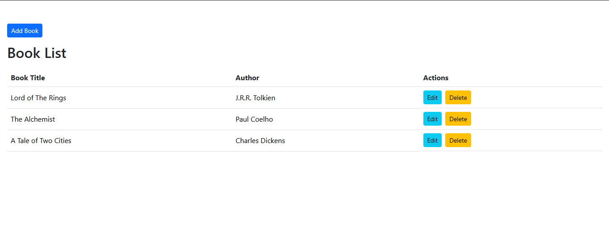
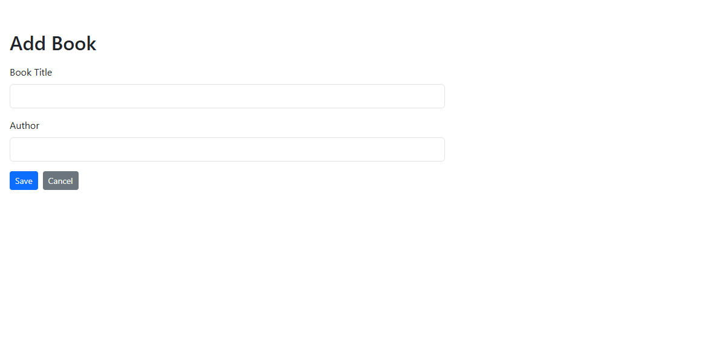
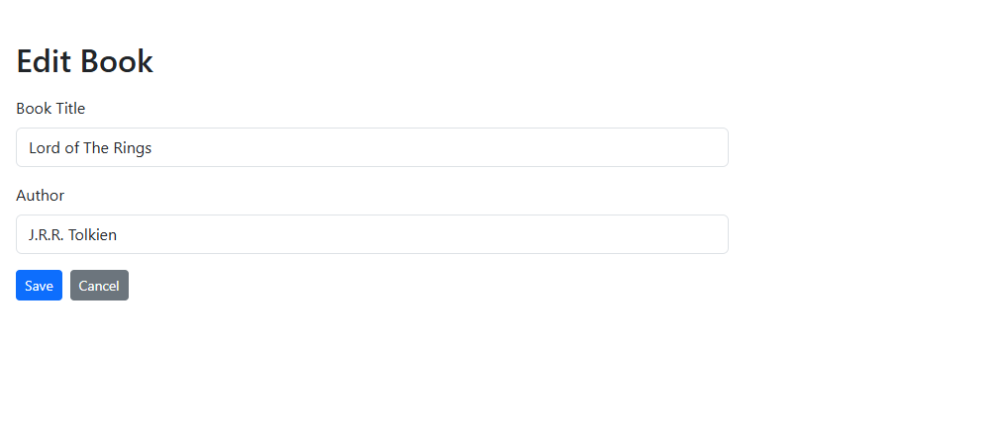

# Book List App

This repo now contains a full-stack Book List application 

## What Changed

- The old `json-server` backend was replaced with a real Express API.
- Book data is stored in MongoDB through Mongoose.
- The frontend now matches the required flow:
  - the book list loads immediately on the home page
  - there is no top navigation
  - users can add, edit, and delete books

## Project Structure

- `crud-json-server/` - React frontend
- `backend/` - Express + Mongoose API

## Running The App

Install dependencies:

```bash
npm install
npm install --prefix backend
npm install --prefix crud-json-server
```

Start both services:

```bash
npm run dev
```

- Frontend: `http://localhost:3000`
- Backend: `http://localhost:5000`


# Outputs





